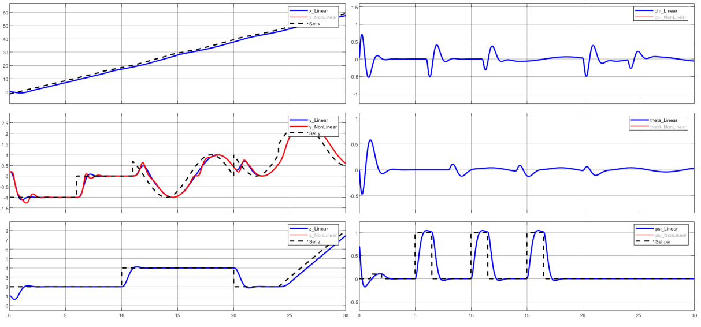
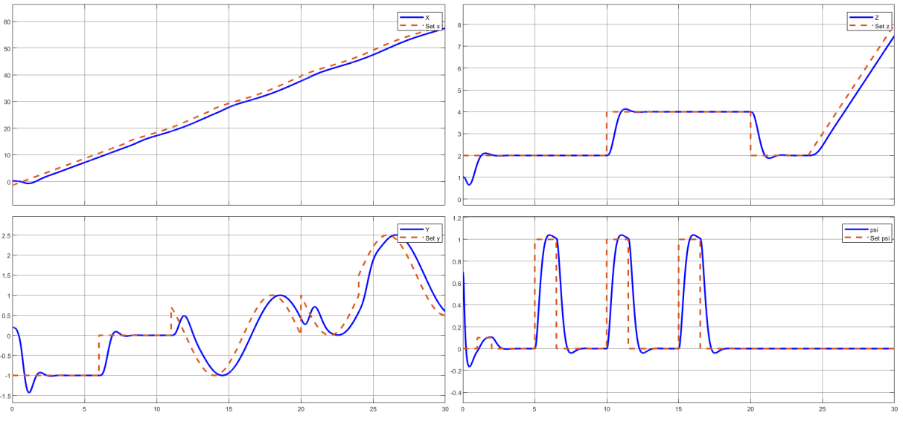
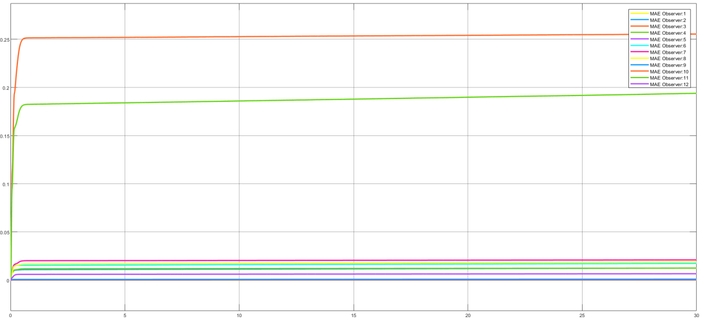
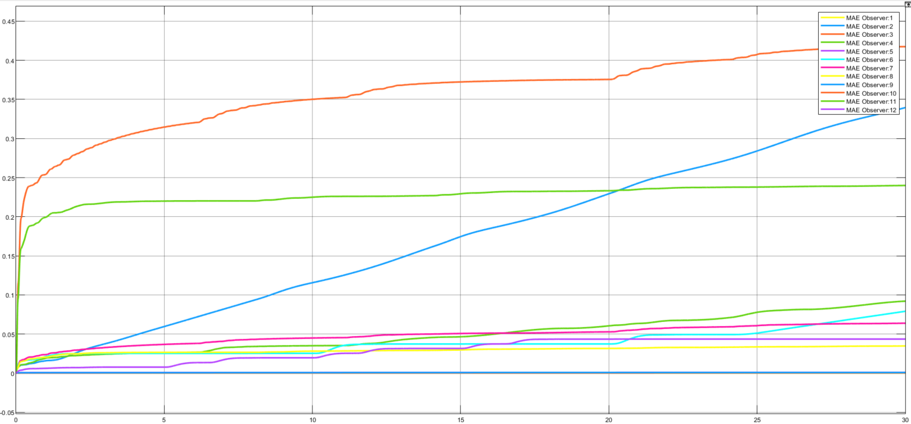

# Phase 3 — English technical report companion

**Original title:** Controller and observer design for a quadrotor system. **Source:** [complete Persian final report](report.fa.pdf), 66 PDF pages. See [team credits](../../../CREDITS.md).

This is a **condensed technical translation and explanation**, arranged by the original chapters. The final report also reviews Phases 1 and 2. Repeated background and screenshot-based matrices are consolidated; this is not a sentence-by-sentence translation of all 66 pages. The [figure gallery](FIGURES.md) retains 89 original embedded images. Page references include the cover and contents. Editorial notes make differences between the report, code and independent checks explicit.

## Chapter 1 — Introduction and quadrotor overview

*Source: PDF pages 8–13.*

The final report studies quadrotor control using modeling, linearization, feedback and estimation. It describes the frame, four motors/propellers, commonly used sensors, electronic actuation and the role of the flight controller. PID and LQR are introduced as motivating control approaches.

The project is a MATLAB/Simulink study. The component overview does not establish construction of a physical vehicle, a real sensor dataset or flight testing.

## Chapter 2 — MATLAB code and Simulink structure

### State equations and hover linearization

*Source: PDF pages 15–22.*

The state vector has twelve elements, `[x,xdot,y,ydot,z,zdot,phi,theta,psi,p,q,r]`. The four control channels are total thrust and three torques. Simulink integrators implement translational/rotational states and their initial conditions, while angle states are wrapped in the nonlinear model.

The hover equilibrium sets the state to zero and thrust to `m*g`. The script forms symbolic Jacobians, calculates the linear matrices, obtains Jordan and transfer-function representations, and plots poles and time response. All open-loop eigenvalues are zero, and the report shows growing responses under unit-step input.

The equations and phase-specific parameters are collected in [MODEL.md](../../../docs/MODEL.md). The local model contains fourth-order horizontal and second-order vertical/yaw integrator chains. It is internally unstable and not BIBO stable.

### Controllability, observability and minimal realization

*Source: PDF pages 23–26.*

The report gives controllability and observability ranks of 12, then studies a staircase decomposition and `minreal`. It ultimately notes that no reduction is needed because the realization is controllable and observable.

**Editorial correction:** the report also says the system is not stabilizable/detectable, following incorrect Boolean eigenvalue indexing in the code. Full controllability/observability imply stabilizability/detectability here. The English overview uses the correct nominal-model conclusion.

### Feedback, LQR and reference compensation

*Source: PDF pages 26–32.*

The controller design uses pole placement and a closed-loop matrix `A_feedback=A_eq-B_eq*Kfeedback`. An LQR section then computes optimal linear feedback for specified state/input weights. Static precompensation uses the closed-loop DC gain and its pseudoinverse for reference channels `[x,y,z,psi]`.

Dynamic precompensation adds four reference-error integrators. The report discusses extending the plant and computing an augmented LQR gain. The native code uses a sixteen-state augmented system.

**Editorial correction:** a statement in this section says the augmented pair is not controllable. Exact rational checks of the supplied `Ai` and `Bi` give rank 16 of 16. A numerically conditioned rank calculation and a documented tolerance are needed to reconcile the historical claim.

### Actuators and observer structure

*Source: PDF pages 33–37.*

The report applies saturation limits to the feedback signals and constructs two state estimators. The full-order observer reconstructs all twelve states from four measured outputs. The reduced-order observer uses those four direct measurements and eight dynamic states to reconstruct the remaining state components.

The reduced-order design introduces a stable `F`, an injection matrix `L_RO`, a Sylvester transformation `T_O`, and reconstruction matrices `Q_1` and `Q_2` derived from `[C;T_O]`. The final Simulink model includes separate observer subsystems.

## Chapter 3 — Review of Phases 1 and 2

*Source: PDF pages 39–48.*

The report reviews open-loop response, controllability/observability and linear/nonlinear implementation from Phase 1, followed by state feedback, trajectory generation and reference compensation from Phase 2. It repeats the dominant feedback pair at `-0.5 ± 0.5j`, with the faster poles near `-9` to `-9.9`.

It compares pole-placement and LQR outputs, static/dynamic reference behavior and local nonlinear response. The report describes slower or less accurate tracking in some pole-placement tests and improved behavior in selected LQR tests. The illustrated behavior depends on the tested branch and reference signal; no all-scenario superiority claim is made here.

For the detailed English discussion of those earlier phases, see [Phase 1](../../phase-01/reports/report.en.md) and [Phase 2](../../phase-02/reports/report.en.md).

## Chapter 4 — Final-phase experiments

### 4.1 Integral LQR tracking

*Source: PDF pages 50–51.*

The report uses trial-and-error weighting choices to balance tracking accuracy, response speed and control effort. It augments the plant with four error integrators and designs an LQR gain over the combined sixteen-state system.

The active saved Live Script uses:

```matlab
Q = diag([10,1,10,1,40,3,10,10,1,1,1,1,500,3000,3000,400]);
R = diag([1,5,1,1]);
Ai = [A_eq, zeros(12,4); -C_final([1,2,3,6],:), zeros(4,4)];
Bi = [B_eq; zeros(4,4)];
```

The gain is partitioned into the first twelve state-feedback columns and the last four integral-feedback columns. The report plots linear/nonlinear position/attitude responses alongside reference signals.



Original report, PDF page 51.

**Tuning difference:** the report's displayed `Q` uses `3500` where the active Live Script uses `3000`. The saved report figure and active code should therefore be treated as potentially different tuning revisions.

### 4.2 Actuator constraints

*Source: PDF pages 52–53.*

The report limits control inputs to approximate physical actuator capabilities. It treats vehicle weight as approximately 10 N and assumes maximum total thrust about 2.5 times that value. It adds equilibrium thrust to the nonlinear plant input, while the linearized plant receives a deviation input.

**Technical clarification:** the equilibrium offset is handled through `delta U=U-Ue`. The linear model does not explicitly retain a separate `m*g` input term; adding it again to a deviation-input block would change the operating point.

Saved saturation examples include total thrust `[0,25]`, a thrust-deviation branch `[-10,15]`, roll/pitch torque bounds `[-1.5,1.5]` and yaw bounds `[-1,1]`. Different branches include rotor-speed-related saturation and first-order transfer functions. These are selected saved parameters, not experimentally measured motor limits. Scenario routing and the intended actuator branch must be checked in MATLAB.

### 4.3 Full-order and reduced-order observers

*Source: PDF pages 54–59.*

The full-order observer uses measured outputs `[x,y,z,psi]`. Its desired poles are:

```text
-20, -20, -20, -21, -21, -21,
-21.5, -21.5, -21.5, -22, -22, -22
```

The script computes `L=place(A_eq',C_eq',poles_obsv)'`, giving nominal error dynamics `A_eq-L*C_eq`. The poles are chosen faster than the dominant controller poles so that estimated states can converge promptly.

The reduced-order observer has eight internal dynamic states. It reconstructs the full state vector using measured outputs and transformed coordinates. The report shows explicit `F` and `L_RO` matrices and compares both observer outputs in the closed-loop tracking scenario.



Original report, PDF page 57. The report also gives a Simulink implementation of MAE using subtraction, absolute value, integration and normalization by elapsed time.

The nominal MAE discussion identifies comparatively larger errors in some channels, including states 7 and 9, and interprets the full-order observer as more accurate in its selected test. This is a report-specific result, not a general mathematical advantage of full-order estimation.

**Source differences:** the reduced-order `F` and `L_RO` shown on PDF page 55 differ from the active Live Script's matrices. The report sometimes explains full-order accuracy as access to all states; the implemented estimator instead uses the same four measured outputs and reconstructs unmeasured states from the model. No direct measurement of all twelve states is required by that design.

### 4.4 Noise

*Source: PDF pages 60–61.*

The report adds noise using Simulink noise blocks and compares observer MAE. It describes errors increasing more strongly for the reduced-order observer and lower error levels for the full-order observer in the illustrated case.



Original report, PDF page 61. The comparable reduced-order result appears on PDF page 60 in the gallery.

**Saved configuration note:** the final model's four noise blocks use differing powers and sample times. One has `Ts=0.01 s`; three have `Ts=0.1 s`. Do not assume every archived branch implements the assignment's 100 Hz scenario. No new numerical MAE values are invented from the plotted screenshots.

### 4.5 Model uncertainty

*Source: PDF pages 62–63.*

The specified uncertainty experiment scales the plant state matrix to `1.2*A` and reuses nominal estimator/controller gains. The report describes growing reduced-order error channels (including channels 4 and 5 in its discussion) and more gradual error growth for the full-order observer.



Original report, PDF page 63. The reduced-order result appears on page 62.

The report interprets the full-order observer as more tolerant of this chosen matrix perturbation, while noting room for improvement. These results do not establish a certified robustness margin or validate all physical parameter uncertainties. Applying a scalar factor to the complete `A` matrix is the particular exercise tested.

## Chapter 5 — Conclusions and suggestions

*Source: PDF page 65; references on page 66.*

The report concludes that modeling and modern feedback can improve the selected simulated responses, while real implementation faces imperfect models, noisy measurements, sensing requirements and actuator constraints. It recommends further work on optimal/robust control and estimator tuning.

The repository preserves this work as a course simulation study. It does not claim hardware flight validation, a completed robust/adaptive controller or a new control algorithm.

## Additional branches in the final model

Static inspection finds Simulation 3D UAV Vehicle and Scene Configuration blocks, motor/PID branches, Rate Transition and Zero-Order Hold blocks, and an explicitly **commented-out Kalman Filter block**. Those contents extend beyond the main experiments translated above.

The optional assignment requests complete controller/observer discretization and a hybrid Kalman/LQG comparison. The saved blocks alone do not demonstrate that those tasks were completed or validated. The Kalman branch needs review before activation. The original presentation link is preserved separately in [presentation/](../../../presentation/README.md).

[References](../../../docs/REFERENCES.md) · [Reproducibility and source differences](../../../docs/REPRODUCIBILITY.md) · [All original figures](FIGURES.md)
